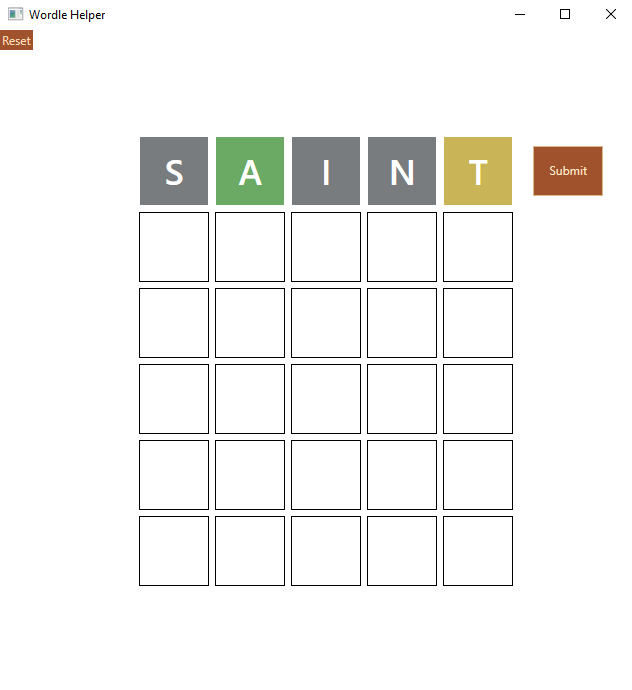
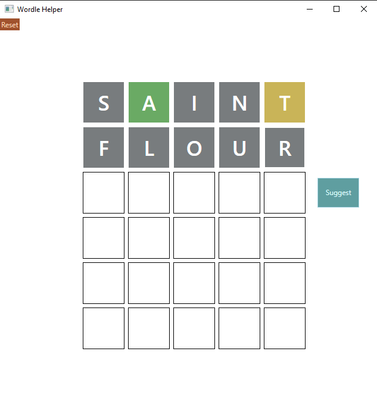
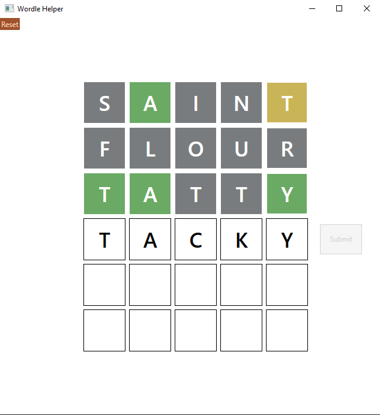

# Wordle Bot 
## Setup
This program requires a SQL Server database containing your word list.  
You can find lists of english words here:
- [All english words (Not all words are accepted by wordle)](https://github.com/dwyl/english-words)  
- [Scrabble words](https://boardgames.stackexchange.com/questions/38366/latest-collins-scrabble-words-list-in-text-file)

Once the database is running you have to edit the app.config in "Wordle Helper .Net Framework/" to point the program to the word column of your database.  
 ``` xml
 <connectionStrings>
	<add name="connection" connectionString="server=DESKTOP-SV6S892;trusted_connection=Yes"/>
	<add name="table" connectionString="english.dbo.scrabble"/>
	<add name="column" connectionString="words"/>
</connectionStrings>
```
## Running
Start by typing out your first guess. \
Next fill in the feedback given by wordle. \
You can cycle colors using the arrow keys, mousing over a letter and left/right clicking, or mousing over a letter and scrolling.\
Once you have entered the feedback click submit or hit enter.

\
\
You can get a word suggestion by clicking the suggest button, or by pressing enter while the row is empty.\
\
\
\
The Suggestion will fill the current row. You can either provide the wordle feedback or use backspace to delete the suggestion.\
\
\
\
The program is deterministic and will always give the same suggestion given the same inputs.